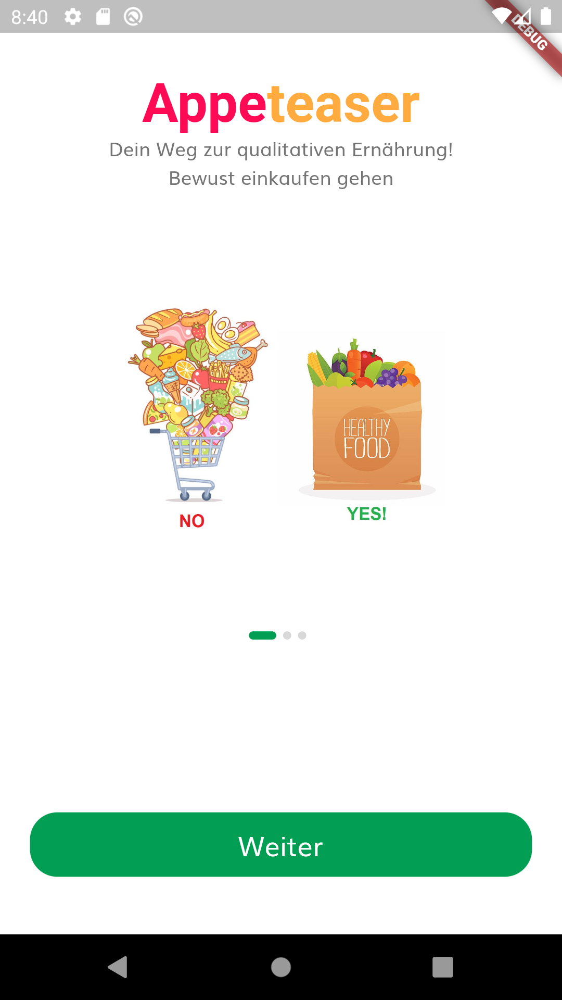

# Appeteaser App
## Project for Study Case at HFU 2021

The Appeteaser project is a new app approach that offers consumers holistic support in finding, 
selecting and distributing healthy, regionally produced foods and providing more detailed information 
about the producers. On the basis of sustainability aspects and the integration of prosocial 
functions, consumers are enabled to design and run an individual weekly market under their own 
conditions. Within an integrated social network with friends lists and real-time notifications, 
consumers can form social food shopping groups and create their own pick-up and delivery routes 
to define mobile marketplaces for food distribution. With real-time group notifications about new 
food and producer information, the mobile social food experience is kept dynamic and the 
establishment and promotion of healthy and sustainable eating habits is supported.

##Screenshots

